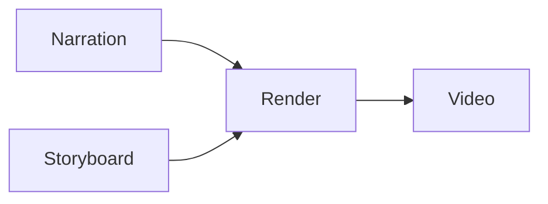

# App Video Render

## Design

`app-video-render` prepares and reports the MP4 render for the current run. It performs no model call.

**Where the render actually runs.** `execute()` validates the slug, checks the toolchain, resolves the audio layout, and writes `render.json`; it does not itself capture frames or invoke ffmpeg. The MP4 is produced by `render-video.sh`, which this node owns and the panel's **Render MP4** button opens in a visible terminal. The helpers in `render.ts` — `buildRenderArgs`, `buildMuxArgs`, `readProjectTimeline` — are the deterministic pieces that path is built from and are covered by `server/video-render.test.ts`.

## The render script

`render-video.sh` sits in this directory and is the only thing the host launches:

```sh
render-video.sh --run-id <id> --base-url <studio origin> --out <absolute mp4 path>
```

The host finds it through `nodePluginScript(type, 'render-video.sh')` — it looks for that file in the directory of whichever node declares the `video-spec` capability, and knows nothing else about it. Nothing is declared in the host `package.json`: a script entry there would mean the host owns a command on this node's behalf, so removing the node would leave a dangling `npm run`, and two nodes could never both own a render step.

The script validates its arguments, checks `node`/`curl`/`ffmpeg`, and fetches the run's spec from `/api/video/spec/<run-id>` before doing anything expensive. It then hands off to `scripts/render-video.mjs` or `scripts/render-video.ts` beside it.

**That handoff target is not yet implemented.** Frame capture needs a browser driver, so it cannot live in bash. Until the file exists the script exits `2` and prints the contract it expects. Two known gaps to close when writing it: `RenderEntrypoints.tsx` fetches `/api/projects/:name`, which `server/api.ts` does not implement (`/api/video/spec/:runId` is the endpoint that does), and `buildMuxArgs()` is imported by `server.ts` but never called.

Exit codes: `0` the MP4 exists at `--out`, `2` no renderer installed, `64` bad arguments, `1` anything else.

The audio mix is the part the renderer cannot delegate. `scripts/render-video.ts` supports exactly one looped background track (`--music`), which is wrong for narration: a stitched voice track would loop when it is shorter than the video and drift out of sync with the clips. So the node always renders silent (`--no-audio`) and builds the mix itself, placing each clip's MP3 at that clip's real start offset.

Clip offsets come from the narration `timeline`, not from a running total of planned durations. `fish-audio-narration` measures every MP3's duration, estimates multi-shot anchor positions from the spoken text, and writes the resulting shot lengths back into `chapter/chapter-N.json`. Manifests written before `timeline` existed fall back to each clip entry's own `startSeconds`.

## Toolchain

The renderer uses a separate, git-ignored toolchain install. Before rendering, the node checks for `scripts/render-video.ts`, the run asset directory, `playwright-core`, `vite`, and `ffmpeg`, and reports each missing piece with its own fix:

```sh
cd data/idea-to-app-builder && npm install
brew install ffmpeg
```

`render-video.ts` also needs a local Chromium-family browser (Chrome, Edge, Brave, or Chromium), or `PLAYWRIGHT_BROWSER_PATH` pointing at one. That check belongs to the renderer and surfaces in the render log.

## Input And Output

- Input: one or more upstream JSON manifests. The `fish-audio-narration` manifest supplies the clip MP3s and the storyboard/Demo UI branches supply the document and slug. Either alone is enough — without narration the node renders a silent or music-only video.
- Output: JSON manifest with the video path and playable URL, byte size, measured and planned duration, encode settings, the audio mix summary, per-clip start offsets with their narration file, and the exact commands that ran.
- Side effects: writes `video.mp4` and `render.json` into `data/assets/<workflow-id>/generated/<run-id>/`. Reusable video-node assets, such as background music, live under `data/assets/<node-id>/`.

## Project Validation

Validation belongs to this node and follows the renderer's own contract. It accepts every scene type implemented under `renderer/`, including `image`, `video`, and the Semrush scenes. It does not reuse the storyboard author's quality rules, so measured item durations may coexist with the original `**anchor**` markers in speech.

The node deterministically prefers the narration document when it carries measured timing, even if an untimed Demo UI document reaches the render node first. Unsupported extra upstream outputs and missing item durations are recorded in logs and in the output manifest's `warnings` array. They are advisory and do not change an otherwise successful node into workflow warning status.

Missing required render input, an invalid renderer document, an unusable slug, or an unready render environment remains blocking. Narration overrun checks run only when every item has positive timing; otherwise the node logs that the check was skipped instead of comparing audio against 0.1-second fallback slots.

## Audio Mix

Each clip MP3 becomes one ffmpeg input, normalized to 48 kHz stereo (`amix` rejects inputs whose rate or layout differ) and delayed with `adelay` to its clip start. Background music from `data/assets/<node-id>/music/bgm.*` is looped, scaled by `musicVolume`, and trimmed to the timeline length. The mix is padded with `apad` so `-shortest` trims the audio to the video instead of cutting the video down to a shorter narration.

## Configuration

`slug` overrides the slug from the upstream manifest; blank uses the upstream value. `resolution` (`1080p` or `4k`), `fps`, `crf`, and `x264Preset` map to the builder's own flags — the defaults trade a little quality for render time, since the builder's own defaults (`crf 12`, `slow`) are tuned for a final master.

`narration` and `music` toggle the two audio sources, `musicVolume` sets the music gain, and `audioBitrate` sets the AAC bitrate. `validateProject` applies this node's renderer-owned input contract before any render work starts. `timeoutMs` bounds the render; the whole process group is terminated on expiry, because `npm run` is only the parent of the renderer.

`cleanIntermediates` deletes the silent master and the working directory `render-video.ts` fills with one MP4 per clip. Those intermediates are created on every render regardless of `--output`, so leaving them costs roughly the size of the finished video again per run. Only directories that appeared during this run and contain a `clips/` folder are removed.

`dryRun` reports the planned commands and the toolchain state without rendering. Use it to check a machine before committing to a render that captures every frame through a browser.

## Failure Behavior

Missing upstream input, a missing or invalid render document, an unusable slug, and an unready toolchain are node-owned blocking warnings (`⚠️`). `dryRun` reports preflight problems without committing to a render. Advisory validation messages stay in the logs and output manifest without setting warning status.

The editor's **Stop** action terminates the server-side Worker, which does not reach processes that Worker spawned. A render already in flight keeps running to completion. The node logs its process group id at spawn time so it can be stopped by hand:

```sh
kill -- -<pid>
```

`timeoutMs` is the automatic bound on that: the whole process group is signalled, not just `npm`.
